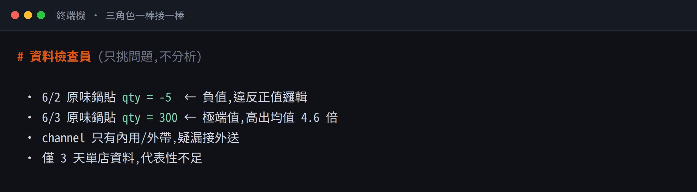
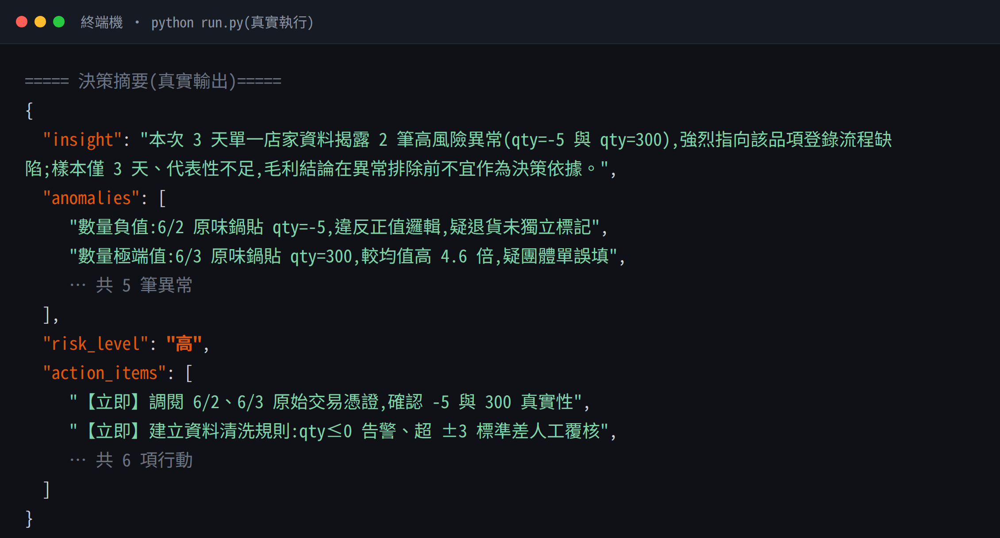
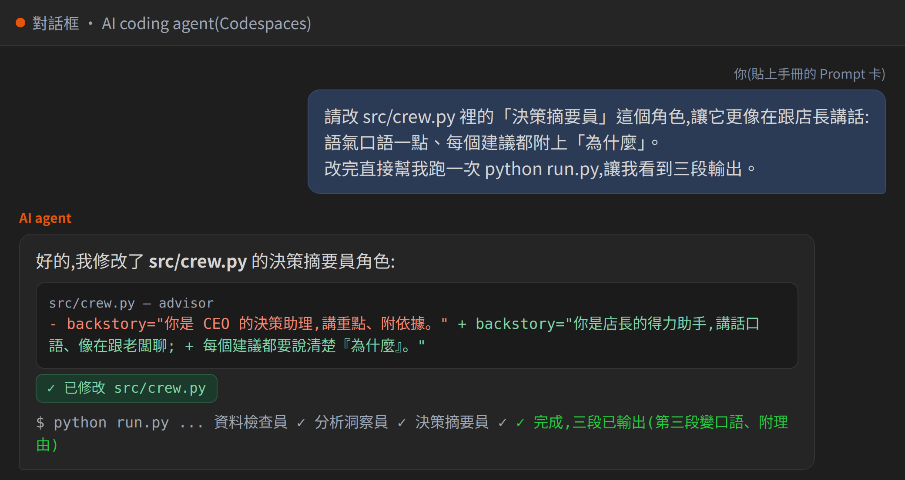
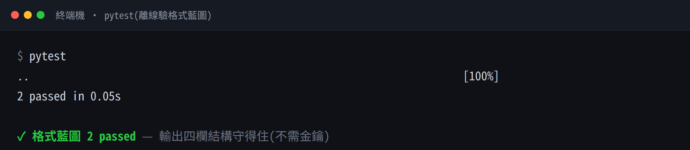

# M12 學員工作手冊｜照著做就會的逐案例路徑

> 這份是給**學生自己照著走**的。每個案例都長這樣:**目標 → 複製這段貼上 → 你應該看到 → 沒看到怎麼辦**。
> 配合投影片(`slides/u12-c1` ~ `u12-c4`)使用;投影片講「為什麼」,這份給你「照著做」。
> 參考用的「檔案在哪」「金鑰怎麼設」在同資料夾的 [`README.md`](./README.md)。

**這個專案你只要看三個地方:** 左邊 **檔案樹**、跟 AI 講話的 **對話框**、跑程式的 **終端機**。其他都先忽略。

---

## 課前(一次就好):設好金鑰

照 [`README.md` 的「課前準備」](./README.md) 設好 **Codespaces Secrets** 的 `GITHUB_MODELS_TOKEN`(建 PAT 時要勾 `Models: Read`、Secrets 頁要按 Manage access 勾這個專案、設完重開 Codespace)。

> 沒設金鑰也能先做「對話框」的練習(課1 破冰、改角色文字),只有實際 `python run.py` 那步需要金鑰。

---

# 課 1 ｜ 認識三角色 + 第一次跑起來

## 案例 1A ｜破冰:讓 AI 當場扮三個角色(不用金鑰)

**目標:** 還沒碰程式前,先用講的看懂「三個 agent 分工」。

**① 複製這段,貼到對話框,按 Enter:**
```text
你現在同時扮演三個角色:資料檢查員、分析洞察員、決策摘要員。
看這份資料 data/sales_sample.csv,每個角色各講一段:
- 資料檢查員:只挑出資料裡怪怪、要人確認的地方
- 分析洞察員:根據檢查過的資料看趨勢與風險
- 決策摘要員:整理成老闆能直接做的建議
```

**✓ 你應該看到:** AI 回三段,第一段挑出「數量 -5」「數量 300」之類的怪資料,第二段分析、第三段給建議。三個角色一棒接一棒,像這樣:



**✗ 沒看到 / 卡住:**
- 它只回一段 → 補一句「請分成三個角色、各講一段」。
- 它看不到 csv → 把 `data/sales_sample.csv` 在編輯器打開,或把內容貼給它。

---

## 案例 1B ｜第一次跑 `run.py`(需金鑰)

**目標:** 把剛剛「用講的」變成可重跑的程式,看到固定四欄輸出。

**① 在終端機打這行,按 Enter:**
```bash
python run.py
```

**✓ 你應該看到:** 三個角色輪流輸出(verbose),最後印出一段 `===== 決策摘要 =====`,裡面有四欄:`insight`、`anomalies`、`risk_level`、`action_items`。**你的終端機真的會長這樣**(這張是實際跑出來的):



**✗ 沒看到 / 卡住:**
- `KeyError` / 抓不到金鑰 → 回 [README 課前準備](./README.md),三步漏一步就抓不到;設完要**重開 Codespace**。
- `rate limit` / `429` → 這把 key 今天用很兇,換一把備援(README 有寫)。
- 跑很久 → 正常,CrewAI 一次會呼叫好幾次 AI,等它印完。

> 💡 省額度:先在對話框把方向確認好,再跑完整 `run.py`,可以少燒很多免費額度。

---

# 課 2 ｜ 改角色講的話 + 鎖死輸出格式

## 案例 2A ｜把「決策摘要員」改得更像在跟老闆講話

**目標:** 你改的是**文字**(角色的 role/goal/backstory),不是程式。

**① 複製這段,貼到對話框,按 Enter:**
```text
請改 src/crew.py 裡的「決策摘要員」這個角色,讓它更像在跟店長講話:
語氣口語一點、每個建議都附上「為什麼」。
改完直接幫我跑一次 python run.py,讓我看到三段輸出。
```

**✓ 你應該看到:** 對話框裡,AI 改了 `src/crew.py` 裡 advisor 那段文字、再自己跑一次,第三段(決策摘要)變得更口語、有附理由。畫面大概像這樣:



**✗ 沒看到 / 卡住:**
- 它改完沒跑 → 補一句「請直接幫我執行 python run.py」。
- 看到紅字 → 把那段紅字整段複製,貼回對話框問它怎麼修。

## 案例 2B ｜換你練習:把「資料檢查員」改嚴格

**① 複製這段:**
```text
請把 src/crew.py 裡的「資料檢查員」改得更嚴格:
連「數字太完美、可能是假資料」也要標出來。改完再跑一次。
```
**✓ 成功:** 檢查員開始挑出更多可疑的地方 = 你會自己改角色了。

## 案例 2C ｜格式藍圖:確認輸出一定有那四欄(不用金鑰)

**目標:** 「格式藍圖」就是規定 AI 一定要交出 `insight / anomalies / risk_level / action_items` 四欄。它已經寫在 `src/blueprint.py`。

**① 在終端機跑(驗證藍圖,不需金鑰):**
```bash
pytest
```
**✓ 你應該看到:** `2 passed`。代表格式藍圖有效、輸出結構守得住:



**想加一欄?複製這段:**
```text
請在 src/blueprint.py 的 Decision 多加一欄 confidence(信心高/中/低),
並更新決策摘要員,讓它每次都要填這欄。
```

---

# 課 3 ｜ 換成你的資料 + 做一個「按一下就跑」

## 案例 3A ｜換成你自己的品項(手動,先認識資料)

**目標:** 先親手換,之後出錯你才找得到。

**① 動作(自己做,不用 prompt):**
1. 左邊檔案樹打開 `data/sales_sample.csv`(用 VS Code 開,別用 Excel,會亂碼)。
2. 找到「原味鍋貼」那格,改成你想賣的(例:韭菜鍋貼)。**只改品項、數字先別動、逗號別刪**。
3. 按 `Ctrl + S` 存檔(檔名旁小白點消失 = 存好)。

**② 在終端機跑:**
```bash
python run.py
```
**✓ 成功:** 結果裡看得到你換的品項。

**✗ 卡住:** 那行亂掉 → 多半是逗號被刪到;按 `Ctrl + Z` 復原再改。

## 案例 3B ｜請 AI 做一個網頁按鈕(店長也會用)

**① 複製這段,貼到對話框:**
```text
幫我做一個很簡單的網頁:上面一個按鈕,按下去就去跑這個 crew,
然後把四欄結果(insight/anomalies/risk_level/action_items)顯示在頁面上。
不用漂亮,能按、能看到結果就好,跑在本機就行。
```
**✓ 你應該看到:** 它建一個網頁檔、把服務開起來,給你一個 `localhost` 網址;打開、按按鈕,結果出現。**按鈕背後跑出來的,就是課 1B 那張四欄結果**(`insight / anomalies / risk_level / action_items`),只是顯示在網頁上而不是終端機。

**✗ 卡住:** 給網址打不開 → 看它有沒有說「在某個 port 開好了」,點那個連結;按了沒反應 → 把畫面截圖貼回去問它。

> 觸發有兩種:**按鈕**(上課版,人想看就按)、**排程**(營運版,每天自動跑)。想要每天自己跑,跟 AI 說「幫我設成每天早上自動跑一次」,選 GitHub 排程最省事。

---

# 課 4 ｜ 教它「什麼時候不該信」+ 測壞掉的情況

## 案例 4A ｜加兩條「要先問人」的規則

**① 複製這段,貼到對話框:**
```text
請改 src/crew.py,幫三個角色加兩條硬規則:
1. 如果資料有缺漏,先說「資料不齊,需要人確認」,不要硬算。
2. 如果建議沒有附依據,標成「不可直接採用」。
碰到這兩種都要先停下來提醒人。改完跑一次。
```
**✓ 成功:** 它回「已加入規則」,重跑後遇到缺漏會先喊停,而不是硬給數字。

**馬上驗一次(複製這段):**
```text
這是今天的資料,但其中一天整個沒進來(請故意拿掉幾行再給它)。
請照剛剛的規則處理。
```
**✓ 成功:** 它說「資料不齊、需要人確認」,而不是硬算。

## 案例 4B ｜故意餵三種情況,先猜再驗

**目標:** 別只測「會成功」的。先**用嘴巴猜**它會放行還是擋,再跑對答案。

**① 複製這段,請 AI 幫你建測試:**
```text
幫我建一個 test_scenarios.py,跑三種情況各印結果:
1. 正常資料  2. 缺一天的資料  3. 有人打了負數。
正常的應該放行;缺漏、錯誤的應該擋下、要求人工確認。
```
**② 在終端機跑:**
```bash
python test_scenarios.py
```
**✓ 你應該看到:** 正常 → 放行;缺資料、負數 → 擋下、要人確認。對照你剛剛的猜測,猜對幾個?

**換你埋雷(複製這段):**
```text
在 data/sales_sample.csv 隨便一行,把單價改成比成本還低(例如 1 元)。
再跑一次,看它有沒有把這筆標成「售價低於成本,要確認」。
```
**✓ 成功:** 你親手埋的雷被它抓出來 = 你信得過這個把關了。

---

## 一句話帶走(整個 M12)

> **先檢查資料,再問 AI。資料髒,AI 再聰明也會給你錯答案。**
> AI 講錯時跟講對時一樣有自信 —— 你問它「為什麼」,答得出來才採用。

## 還是卡住?四步排錯

1. 我**預期**看到什麼?
2. **實際**看到什麼?
3. 第一個**有效錯誤訊息**在哪?(把它貼給對話框請 AI 解讀)
4. 它屬於哪一段:對話框沒回 / `run.py` 報錯 / 金鑰問題?

> 金鑰只放 Codespaces Secrets,**不要**貼進程式碼、對話框或 commit。
