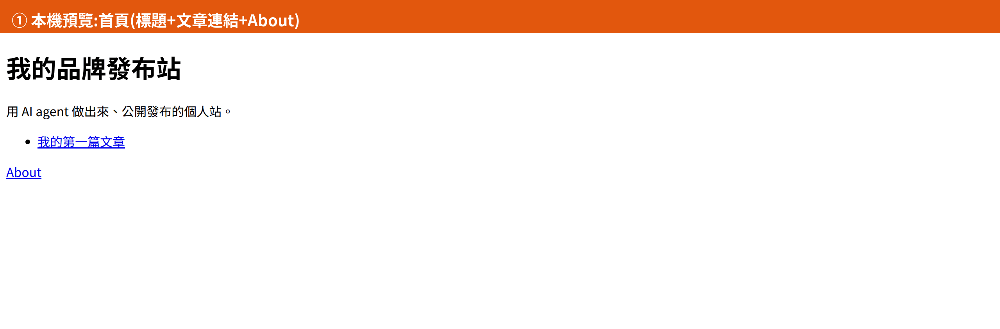
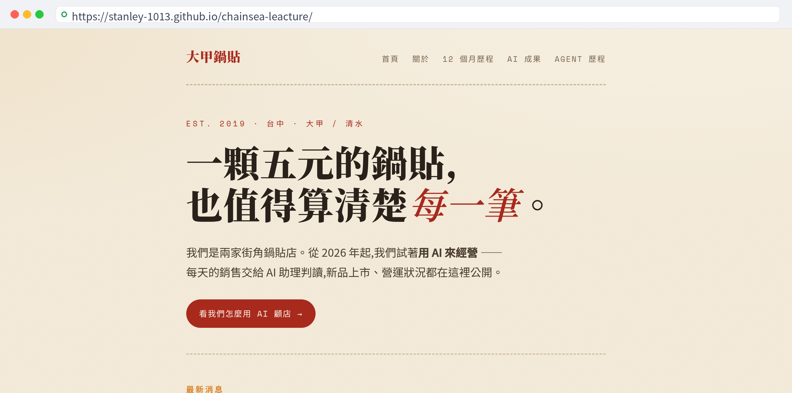
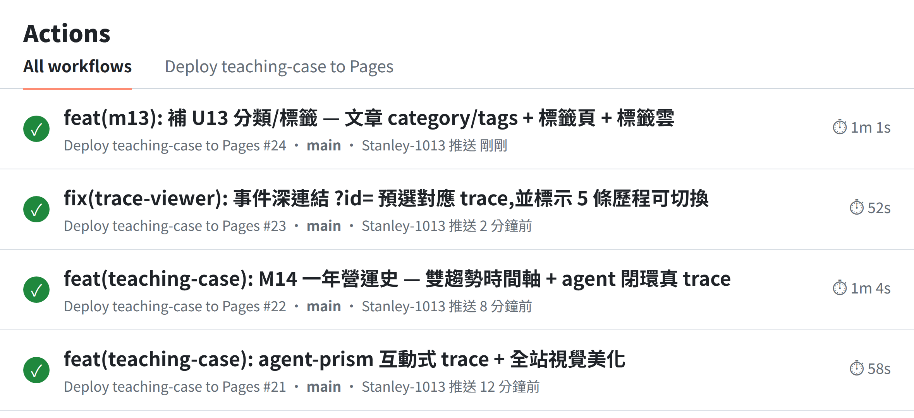

# M13 學員工作手冊｜照著做就會的逐案例路徑

> 給**學生自己照著走**。每個案例:**目標 → 複製這段貼上 / 動作 → 你應該看到 → 沒看到怎麼辦**。
> 配合投影片(`slides/u13-c1`、`u13-c2`);投影片講「為什麼」,這份給你「照著做」。
> 「檔案在哪」「base 怎麼設」的參考在同資料夾的 [`README.md`](./README.md)。

**這個專案你只要看三個地方:** 左邊 **檔案樹**、跟 AI 講話的 **對話框**、跑程式的 **終端機**。

> 心法:**網站背後,其實只是文章檔加設定。** 你不是在寫複雜程式,是在「佈置一間店面」:換招牌(標題)、換油漆(顏色)、貼文章。

---

# 課 1 ｜ 在自己電腦上做出網站(本機預覽)

## 案例 1A ｜複製範本、開出環境(手動,先逛一次)

**目標:** 親手點一次,知道東西放哪,之後不迷路。先認兩個字:**Repo** = 放網站檔案的網路資料夾;**Codespaces** = 瀏覽器裡幫你開好的電腦。

**① 動作(自己點):**
1. 點老師發的**範本連結**,看到一個 GitHub 專案頁。
2. 右上角按 `Fork` → 下一頁按綠色 `Create fork`。
3. 按綠色 `<> Code` → 選 `Codespaces` → `Create codespace`。

**✓ 你應該看到:** 網址左上角變成「**你的帳號** / 專案名」;瀏覽器開出編輯器、跑進度條。

**✗ 卡住:**
- 找不到 Fork → 在專案頁右上角那排;手機版點「⋯」展開。
- Codespaces 跑很久 → 第一次要一兩分鐘,正常,別關分頁。

## 案例 1B ｜本機預覽:先看到範本長怎樣

**① 在終端機跑:**
```bash
npm install
npm run dev
```
**✓ 你應該看到:** 終端機給一個本機網址,打開有首頁 + 一篇文章。範本一開始是**極簡純文字**的樣子(還沒套你的品牌),長這樣:


點來點去會像這樣(首頁 → 文章 → About):



> 範本刻意做得很素 —— 招牌、顏色、文章都還沒換成你的。**下一個案例就用 AI 把它變成你的。**

(`npm install` 第一次跑;之後記得把產生的 `package-lock.json` 一起 commit。)

## 案例 1C ｜請 AI 把它改成你的(換標題、顏色、第一篇)

**① 複製這段,貼到對話框,按 Enter:**
```text
幫我把這個網站範本改成我的:
1. 首頁標題改成「(你的名字 或 你的店名)」。
2. 主色換成我喜歡的顏色(例如溫暖的橘色)。
3. 把第一篇文章(src/content/blog/hello.md)改成一句自我介紹。
改完幫我在本機開起來,給我預覽網址。
```
**✓ 你應該看到:** 它改了設定 + `src/content/blog/hello.md`,本機預覽打開,標題是你的、顏色換了。

**✗ 卡住:**
- 預覽空白 → 等幾秒它還在啟動;或看它有沒有要你按「在瀏覽器開啟」。
- 顏色沒變 → 重新整理頁面;還沒變就跟它說「顏色好像沒換到」。

**之後你只會改這四個地方:**

| 想改 | 檔案 / 位置 |
|---|---|
| 文章 | `src/content/blog/*.md`(想加一篇就多一個檔) |
| About | `src/pages/about.astro` |
| 設定(標題/base) | `astro.config.mjs` |
| 圖片 | 丟到 `public/images/`,文章裡用 `` |

## 案例 1D ｜用 AI 把素材整理成文章大綱

**① 複製這段(把你的筆記貼在後面):**
```text
這是我最近的學習筆記(把你的內容貼上來)。
請幫我整理成 2 篇文章的大綱,每篇 3 到 5 個重點,語氣口語、像在跟朋友分享。
```
**沒有筆記?** 直接用講的:
```text
我最近上了 AI 應用課,學會用 AI 做營運助理跟網站。
幫我從這件事,整理成 2 篇文章的大綱。
```
**✓ 成功:** 拿到 2 篇可以動手寫的大綱。**挑一個重點、補一句你自己的話** —— 文章就有你的味道了。

---

# 課 2 ｜ 讓它公開上線(拿到真網址)

> 先懂兩個字(物流比喻):**commit** = 打包、貼標籤(寫一句改了什麼);**push** = 寄出,送到 GitHub。
> **公開前先檢查:** 不要放電話、住址、未授權客戶資料、公司內部截圖。網路上的東西刪了也可能被存過。

## 案例 2A ｜方法一:手動推上 GitHub、開 Pages(先懂流程)

**① 推上 GitHub(打包、寄出):**
1. 左邊找「原始檔控制」(樹枝分岔圖示)點它,上面出現訊息框 + 改過的檔案。
2. 訊息框打一句,例如 `第一次上線`,按 `✓ Commit`(問 stage all 就按 Yes)。
3. 按 `Sync Changes / 同步變更`(寄出),第一次要登入授權。

**✓ 應該看到:** 回 GitHub 網頁重新整理,檔案都在上面、時間是剛剛。

**② 開 Pages:**
1. repo 網頁點 `Settings` → 左邊 `Pages`。
2. 來源(Source)選你的**分支**,按 `Save`。
3. 等一兩分鐘、重新整理,上面出現一個 `https://…` 公開網址。

**✓ 成功:** 點那個網址,別人也打得開 = 你的網站上線了。公開網址打開長這樣(這是已部署的範例站,網址列就是真的 `github.io` 公開網址):



**⚠️ 最常卡的地方:** 部署後**樣式壞掉、連結 404** → 多半是 `base` 沒設對。看下一個案例讓 AI 一次修好。

## 案例 2B ｜方法二:讓 AI 設「自動上線」(更完整)

**目標:** 設定一次,以後改完 push 就自己上線(像跟宅配約定期取件)。

**① 複製這段,貼到對話框:**
```text
幫我設定 GitHub Actions,讓我每次 push 之後,
網站就自動重新建置並上線到 GitHub Pages。
順便把 astro.config.mjs 的 base 設對(我的 repo 名稱是:____),確認樣式不會跑掉、文章連結不會 404。
```
> 規則:repo 叫 `<帳號>.github.io` → `base: '/'`;叫別的(例 `my-blog`)→ `base: '/my-blog/'`。

**② 設好後再 push 一次,到 repo 網頁點 `Actions` 分頁:**

**✓ 你應該看到:** 最上面那筆執行紀錄從「轉圈圈」變成**綠色打勾**。綠勾 = 這次自動上線成功。Actions 分頁長這樣(每筆綠勾就是一次成功部署):



**✗ 卡住:**
- 變紅色叉叉 → 點進去把紅字那段複製,貼給對話框問怎麼修。
- 網址 404 → 剛開的話再等一兩分鐘;或確認 `base` 設對。

## 案例 2C ｜(選配)免註冊、一行秒上線

想臨時給人看一眼、不想先辦帳號:
```bash
wrangler deploy --temporary
```
**✓ 成功:** 拿到一個能活 60 分鐘的臨時網址。正式長期用,還是用前面的 GitHub Pages。

---

## 一句話帶走(整個 M13)

> **手動點一次是為了懂它;之後讓 AI + 自動上線,幫你每次自己更新。**
> 改完一個東西 → push → 公開網址真的有變,你就完成了「自主更新閉環」。

## 還是卡住?四步排錯

1. 我**預期**看到什麼?
2. **實際**看到什麼?
3. 第一個**有效錯誤訊息**在哪?(貼給對話框請 AI 解讀)
4. 它屬於哪一段:本機預覽 / commit-push / Actions 部署?
